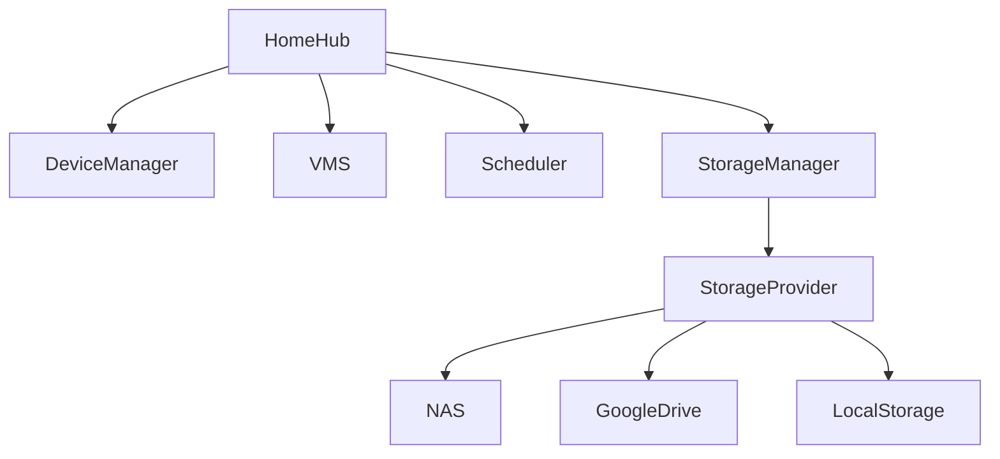

Sí. De hecho, **en esta etapa es mucho mejor un único Software Architecture Document (SAD/HLD)** que una wiki fragmentada.

Todavía no estás diseñando la implementación; estás diseñando el **producto**.

Hay una diferencia importante:

| Documento                                    | Objetivo                                                                                        |
| -------------------------------------------- | ----------------------------------------------------------------------------------------------- |
| Vision Document                              | Explica qué es el producto y qué problema resuelve.                                             |
| **Software Architecture Document (SAD/HLD)** | Describe la arquitectura conceptual, componentes, responsabilidades y decisiones de alto nivel. |
| Low Level Design (LLD)                       | Describe clases, APIs, tablas, protocolos y código.                                             |
| Developer Guide                              | Explica cómo implementarlo.                                                                     |

Nosotros todavía estamos en el **SAD**.

---

## Yo lo escribiría completamente independiente de la tecnología

No hablaría de:

* .NET
* Java
* Docker
* Kubernetes
* PostgreSQL

porque todavía no importa.

Hablaría de:

* responsabilidades
* dominios
* componentes
* servicios
* necesidades
* restricciones

Es decir:

> ¿Qué debe existir?

No

> ¿Cómo lo programo?

---

# El índice sería algo así

```text
HomeHub

Software Architecture Document

Versión 0.1
```

---

## 1 Introducción

* Propósito
* Objetivos
* Motivación
* Alcance
* Público objetivo

---

## 2 Problema

¿Por qué existe HomeHub?

¿Qué problema intenta resolver?

¿Por qué Home Assistant no alcanza?

¿Por qué un DVR no alcanza?

¿Por qué un NAS no alcanza?

---

## 3 Visión

¿Qué es HomeHub?

¿Qué NO es?

¿Cuáles son sus principios?

---

## 4 Conceptos

Con definiciones completas.

Por ejemplo.

¿Qué es un

* DVR
* NVR
* VMS
* NAS
* Storage
* Storage Node
* Storage Provider
* Domótica
* IoT
* Automatización
* Evento
* Timeline
* Stream
* Buffer
* Replicación
* Alta disponibilidad

---

## 5 Objetivos

Por ejemplo

* Centralizar dispositivos.
* Centralizar cámaras.
* Automatizar.
* Almacenar.
* Permitir acceso remoto.
* Ser desacoplado.
* Ser distribuido.

---

## 6 Requerimientos

Funcionales

No funcionales

Escalabilidad

Disponibilidad

Seguridad

---

## 7 Arquitectura Conceptual

El primer gran diagrama.



Y explicar absolutamente todo.

---

## 8 Componentes

Un capítulo enorme.

Cada componente.

Responsabilidades.

Dependencias.

Ejemplos.

Alternativas.

---

## 9 Gestión de Video

Probablemente otro capítulo enorme.

RTSP

ONVIF

Segmentación

Timeline

Playback

Exportación

Eventos

---

## 10 Gestión del almacenamiento

Acá entra todo lo que hablamos.

Storage Provider

Storage Node

Replicación

Retención

Backups

Sincronización

TUS

Buffer

---

## 11 Seguridad

Usuarios

Roles

Permisos

Tokens

Permisos temporales

Auditoría

---

## 12 Casos de Uso

Muchísimos.

Ver cámara

Descargar video

Compartir video

Crear usuario temporal

Crear automatización

Programar escena

---

## 13 Escenarios

Por ejemplo.

"Cortan la luz"

¿Qué ocurre?

"Cae Internet"

¿Qué ocurre?

"El NAS desaparece"

¿Qué ocurre?

"Se llena Google Drive"

¿Qué ocurre?

"La cámara deja de responder"

¿Qué ocurre?

---

## 14 Decisiones Arquitectónicas

¿Por qué Storage Provider?

¿Por qué Storage Node?

¿Por qué segmentar?

¿Por qué no SMB?

¿Por qué desacoplar?

¿Por qué mantener metadatos?

---

## 15 Evolución futura

IA

Reconocimiento facial

OCR

Patentes

Personas

Objetos

Integración con Home Assistant

Alexa

Google Home

MQTT

---

# Lo que más me gusta

Hay algo que surgió durante la conversación y que me parece que debería convertirse en la **filosofía del proyecto**.

No construir un DVR.

No construir un Home Assistant.

No construir un NAS.

Construir un **orquestador**.

Una plataforma cuya función sea coordinar.

Es decir.

```
No almacena.

No procesa IA.

No habla SMB.

No conoce Google Drive.

No conoce S3.
```

Simplemente coordina componentes especializados.

Eso hace que el sistema pueda crecer muchísimo.

---

# Incluso cambiaría el nombre de algunos módulos

Por ejemplo.

En lugar de

```
Storage Manager
```

Lo llamaría

```
Storage Orchestrator
```

Porque no almacena.

Decide.

---

En lugar de

```
Video Manager
```

```
Video Orchestrator
```

Porque tampoco procesa.

Coordina.

---

Y el proyecto entero.

No sería simplemente HomeHub.

Sería algo como

> **HomeHub — Distributed Home Automation & Video Management Platform**

porque ya no estamos hablando solamente de domótica.

Estamos hablando de una plataforma distribuida para la administración integral del hogar.

---

## Creo que este puede convertirse en un documento de arquitectura muy sólido

Con todo lo que hemos discutido, estimaría un documento de unas **120 a 180 páginas en Markdown**, con aproximadamente:

* **40 a 60 diagramas Mermaid** (arquitectura, componentes, secuencias, despliegue, flujos de datos y casos de uso).
* **30 a 50 definiciones técnicas** desarrolladas en profundidad.
* **20 a 30 decisiones arquitectónicas (ADR)** integradas dentro del documento para justificar cada elección importante.
* **Numerosos ejemplos y escenarios** (fallas de red, pérdida de energía, recuperación, permisos temporales, replicación, retención, etc.).
* **Una arquitectura completamente agnóstica de la tecnología**, sin comprometerse con .NET, Docker, bases de datos o proveedores específicos.

Ese documento sería la **base conceptual del proyecto**. Una vez consolidado, cualquier decisión tecnológica (por ejemplo, implementarlo en .NET, Go o Java; desplegarlo con Docker o como servicios nativos; usar PostgreSQL o SQLite) pasaría a ser una consecuencia de la arquitectura, y no el punto de partida. Esa es, en mi opinión, la mejor manera de diseñar un sistema con este nivel de complejidad.
